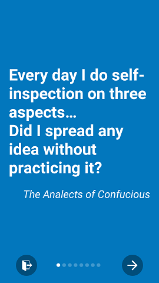
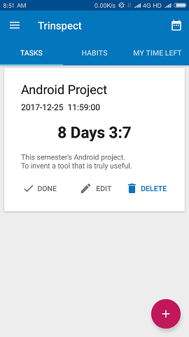
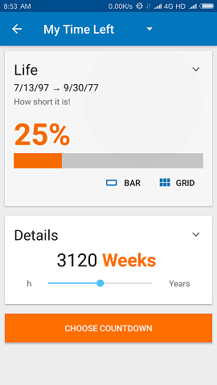
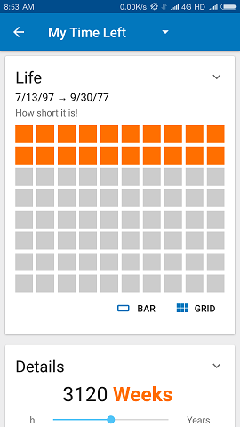
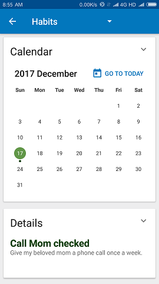
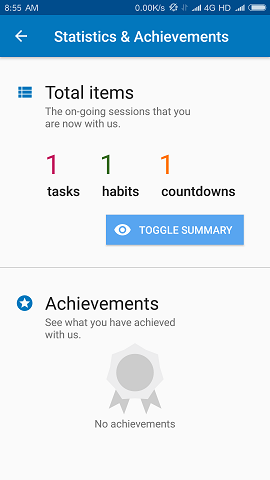

# Trinspect

Be organized. Be new. And be self-educated.

有条不紊、坚持不懈、修身自省。

> Every day I do self-inspection on three aspects... Did I spread any idea without practicing it?
>\
> —*The Analects of Confucious*

> 吾日三省吾身。
> ——《论语·学而》

Support Android 5.0 (Lollipop) and above

支持安卓5.0（萝莉棒\雾）及以上。

   

   

## What is Trinspect, or “三省”？

*Trinspect*, i.e. "the three self-inspections", is a tool to help you organize your tasks, to develop a habit, and to see the time left for your life or college years.

三省可以帮助你规划任务的DDL、为养成好习惯打卡、看到自己剩余的人生岁月或大学生活。

Items (or "*Trinspects*") can be added with varied importance assigned. *Trinspect* will help you rank the tasks in order by their importance and due dates and thus help you organize your tasks at hands.

添加任务，三省会根据重要性和剩余时间自动给任务打分，然后根据分数排列，分数相同则按剩余时间排列。以此来帮助大家规划时间，将目光关注到目前最紧急的事情上去，合理安排时间。

*Trinspect* may also help you develop a new habit. Tell us how frequently you will perform the habit and we will remind you when to do something.

添加习惯，可变频率（中途改变频率要在当前阶段结束后才会改变），助你养成良好习惯。

There's a feature called "time left" in *Trinspec* that will help you see the time left for your life, college years and holidays. We hope this will encourage you to cherish every minute in your life and make the seconds count.

添加长期余时，将剩余时间可视化。把长期规划，如大学，人生，假期余额等直观地显示出来，激励自己，督促自己珍惜每分每秒。

In *Trinspect*, you can see every progress you've achieved with us. Calendar, Timeline, Statistics and Achievements will help you see what you have done better.

在三省中，你可以看到自己的点滴进步。时间线、日历、成就和统计可以帮助你看到自己达成了什么。

## Contribution

This is a rather "dirty" project lacking code beauty and regularity, since this is the first time for the authors to write an Android app. And we would of course credit StackOverflow authors for sharing solutions for so many problems that we've met on our way of development.

** No longer maintained. **

## Authors

* [Aron Lin](https://github.com/AronLin), backend and notifications
* [Celestial Phineas](https://github.com/celestialphineas), UI and visualization
* [Ken Geng](https://github.com/KenGeng), database and make things alive

## Special thanks to these projects

* [AppIntro library](https://github.com/apl-devs/AppIntro)
* [Butter Knife](https://github.com/JakeWharton/butterknife)
* [CompactCalendarView](https://github.com/SundeepK/CmpactCalendarView)
* [RecyclerView Animators](https://github.com/wasabeef/recyclerview-animators)
* [ThreeTenABP](https://github.com/JakeWharton/ThreeTenABP)

## License

GNU General Public License v3.0

Some of the invented wheels (possibly not useful at all) might be released in other licenses later.
